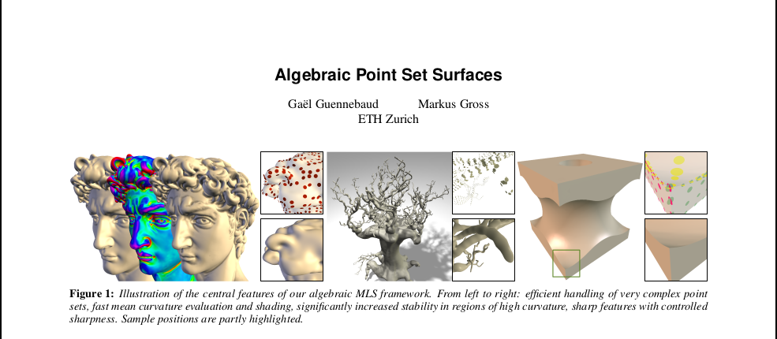

<head> <title>Algebraic Point Set Surfaces</title> </head>

A very interesting paper that I used for my final project in my Geometric
Modeling class (Taughy by Danielle Panozzo @ NYU). What we want to do is take a
basic 3D point cloud without normals to a mesh. The way one would normally think
about doing this is estimating the normal vectors, propagating its orientation,
and then finally constructing a signed distance function which is used to define
a MLS surface. However, this paper takes an interesting bent, in which
every one of those steps is accoplished via the fit of an algebraic sphere.

### The Idea:

We would like to fit a sphere to a set of points, and using that work our way
through the pipeline described above. The question is, why an algebraic sphere?
The fitting of a sphere to a set of point where we minimize geometric distance
to each point is very well studied and is well known to be non-linear, the bane
of anything efficient. Instead, the authors of this paper found that if you have
the surface normals of the point cloud, by switching to the fitting of an
algebraic sphere you can actually achieve a linear solve for the fit.

## Definition of an Algebraic Sphere

Suppose we are working in 3D. An algebraic sphere is defined by the zero
iso-surface of some function, specifically of the scalar field $s_u(x) = [1 x
x^T]u$ where $u = [u_0,\dots,d_4]^T$ is a vector of scalar coefficients that
describes the sphere.

## Fit of a sphere without normals.

The authors of this paper give a method to fit an algebraic sphere without
normals, because they use it to estimate normals later. We'll get into that. 

First, assume that we have $n$ point around which we would like to fit an 
