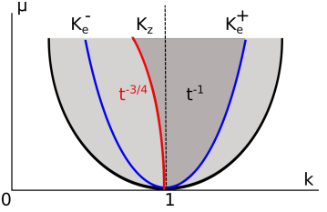

# Research

*Note:* I've been told that the math doesn't render nicely on mobile. This is
a general failing of MathJaX not being responsive, which isn't ideal, but
currently there isn't an easy way to avoid it.

## Diffusive Stability of the Swift-Hohenberg equation near the Zigzag Boundary.

During a Math REU @ Ohio University with [Qiliang
Wu](https://sites.google.com/view/qwu/), I, along with Mason Haberle and
Professor Wu, researched the diffusive stability of the 2D Swift-Hohenberg
equation, that is:

**Theorem:** Given $0 < \varepsilon^2 \ll 1$, the roll solution $u_p(k_z x_1;
k_z)$, where the zigzag wave number $k_z(\varepsilon) = 1 - 
\frac{\varepsilon^4}{512} + h.o.t.$, of the 2D SHE

$$
  u_t = \left[-(1 + \Delta_x)^2 + \varepsilon^2\right]u -  u^3
$$

is nonlinearly stable. That is, given initial pertubation from $u_p$ in the form
$u_0 = u_p + v_0$ where:

$$
  ||\hat{v}_0||_{L^1} + ||\hat{v}_0||_{L^\infty} \ll 1
$$

then we find that $\mid\mid v(\cdot,t)\mid\mid_{L^{\infty}} = O ( t^{-3/4} )$.

{: .center-image }

My main contributions were in:

- (Very painstakingly!) Correcting an error in the coefficients of the
  critical eigenvalue of the
    linearized spectral problem of the 2D Swift Hohenberg equation, as
    originally found in [(Mielke
    96)](https://link.springer.com/article/10.1007/s002200050230) and
    extending said coefficients to a higher level of accuracy.
- Working out and proving the $L^1-L^\infty$ bounds of the nonlinear terms
    of our Split Swift-Hohenberg equation.
- Putting together the final details of the contraction argument to prove
    nonlinear diffusivity.

The paper is still in draft stages, and thus I cannot upload a sufficiently
polished copy here, but the topic was presented by by Qiliang at Miami
Universities' Forty-Seventh Annual Conference in Differential Equations and
Dynamical Systems and their Applications. [Here are the
slides.](./resources/SHE/slides.pdf)

## An investigation into Paraeal

For the *Advanced Topics in Numerical Analysis: High Performance Computing*
course (a mouthful) I took in spring 2019 with Georg Stadler and Dhairya
Malhotra, I wrote a topic paper on Parareal, a parallel-in-time ODE integrator.
You can find the [github repository
here](https://github.com/abhijit-c/Parareal), and more importantly you can read
the [slides](./resources/Parareal/Parareal_Slides.pdf) and the
[report](./resources/Parareal/Parareal.pdf)
