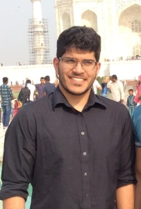

# Abhijit Chowdhary

{: .center-image }

## About Me
- Math and CS guy
- Likes Numerical Methods and Computational Math.
- Not great at web design (sorry)

## Skills
- Linux: Heavy user for 4 years. 
- Fluent with (num/sci/sym)py
- Knows C and C++ for runtime sensitive simulations
    - Fluent with Eigen, libigl.
    - Familiar with GSL and nanoflann. 
- Java for systems (Robotics) and OOP. 
- TA/Tutor for Basic/Fundamental Algorithms (Fall 2017 - Present)
    - Undergraduate/Graduate algorithms course @ NYU taught by Alan Siegel
- First Robotics:
    - Student Member while in high school (2012-2016)
        - Build team member (2012-2014)
        - Business captain/programming team (2015)
        - Team Captain (2016)
    - Adult Mentor now (2016 - Present)
        - Design and programming mentor (2016-Present)
    - Part of [Team 2849: Team Ursa Major](http://hammondursamajor.org/)
- [See my github](https://github.com/abhijit-c)

## Education
- New York University (2016 - Present)
    - Computer Science
        - Basic Algorithms
        - Computer Systems Organization
        - Data Structures
        - Geometric Modeling (Grad)
        - Numerical Computing
        - Operating Systems
    - Mathematics
        - Honors Algebra I/II
        - Honors Analysis I/II
        - Honors Linear Algebra
        - Honors Probability Theory 
        - Topology 
        - Numerical Methods I (Grad)
        - Algebra (Grad)
        - Partial Differential Equations (Grad)
- University of Maryland (Summer 2017/2018)
    - Complex Variables
    - Elementary Number Theory 
	- Introduction to Artificial Intelligence
	- Partial Differential Equations
- Howard Community College (2013 - 2016)
    - Calculus I/II/III
    - Statistics
    - Russian I/II
- Hammond High School (2012 - 2016)
