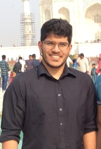

#Abhijit Chowdhary

##About Me
- Math and CS geek
- Likes scientific computing and optimization
- See [my Github](https://www.github.com/TrostAft)
- Not great at web design (Sorry)

##Skills
- See [my resume](Resources/Resume/Resume.pdf)
- Linux: User for 2 years. Currently on Arch Linux
- Familiarity with (num/sci/sym)py
- Knows C and C++ for runtime sensitive simulations
    - Knows how to use GSL and other C numerical libraries
- First Robotics:
    - Student Member while in high school (2012-2016)
    - Adult Mentor now (2016 - Present)
        - Build team member (2012-2014)
        - Business captain/programming team (2015)
        - Team Captain (2016)
        - Design and programming mentor (2016-Present)
    - Part of [Team 2849: Team Ursa Major](http://hammondursamajor.org/)

##Education
- New York University
    - Computer Science
        - Basic Algorithms*
        - Operating Systems*
        - Numerical Computing*
        - Computer Systems Organization
        - Data Structures
    - Mathematics
        - Honors Linear Algebra
    - \* Indicates currently taking
- Howard Community College
    - Calculus I/II/III
    - Statistics
- Hammond High School
